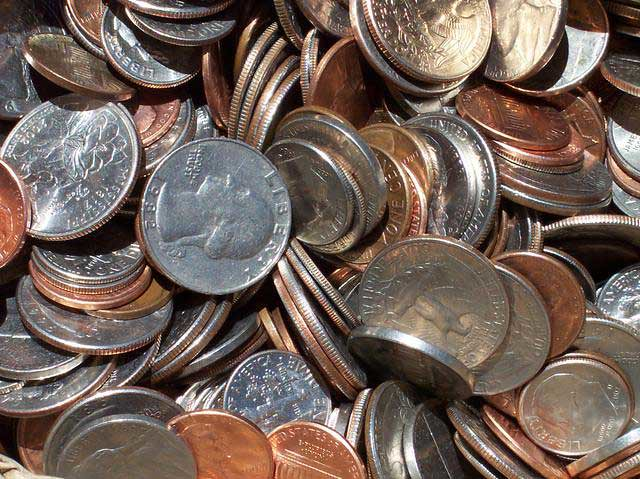
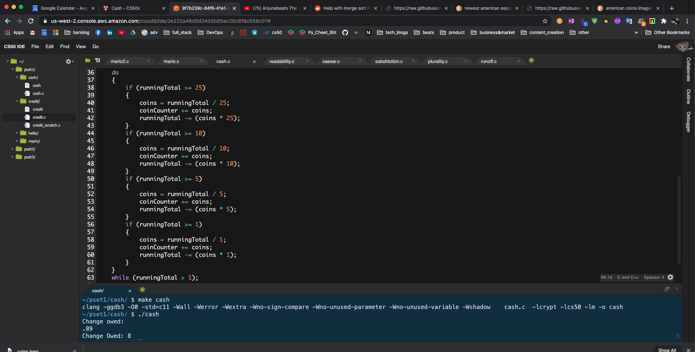

# Change Calculator Using Simple Greedy's Algorithm
## August 2020

## Scope & Purpose
When making change, odds are you want to minimize the number of coins you’re dispensing for each customer, unless you run out. Fortunately, computer science has given cashiers everywhere ways to minimize numbers of coins due: greedy algorithms.

## Background: Greedy's Algorithm
According to the National Institute of Standards and Technology (NIST), a greedy algorithm is one “that always takes the best immediate, or local, solution while finding an answer. Greedy algorithms find the overall, or globally, optimal solution for some optimization problems, but may find less-than-optimal solutions for some instances of other problems.”

## Personal Goal
My objective for this project was to learn a lower level language to better understand how computers work. So I decided to make a coin calculator with C and computer science fundamentals.

## System Prerequisites To Get Started
* C Programming Language

## Sample Output:

## Personal Note

* Hope you enjoyed it. Thank you for your time!

## Author

* **Johneson Giang** - *Invidual Project* - [Github](https://github.com/jhustles)

## License

This project is licensed under the MIT License - see the [LICENSE.md](LICENSE.md) file for details

## Acknowledgments & Credits

* Shout out to Harvard's CS50 David J. Malan

* I definitely want to give a shout out to my dear teacher, mentor, and friend @CodingWithCorgis!

